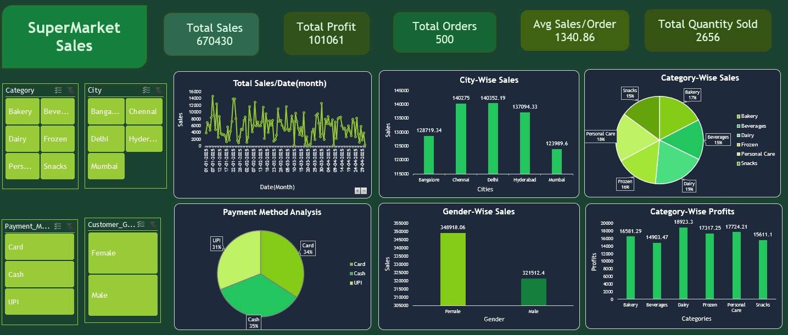

SuperMarket Sales Dashboard

📊 Overview

An interactive SuperMarket Sales Dashboard created using Microsoft Excel to analyze sales performance, profit trends, payment methods, category-wise performance, and customer purchasing behavior.

The dashboard provides an interactive view of key business metrics and helps identify important sales, profit, and customer trends.

🎯 Objective

To analyze supermarket sales data and transform raw data into meaningful business insights using an interactive Excel dashboard.

🛠️ Tools Used

- Microsoft Excel
- Pivot Tables
- Pivot Charts
- Slicers
- KPI Cards
- Data Cleaning
- Data Visualization
- Dashboard Design

📌 Dashboard Features

- Total Sales
- Total Profit
- Sales Performance Analysis
- Profit Trend Analysis
- Location-wise Sales Analysis
- Category-wise Sales & Profit Analysis
- Payment Method Analysis
- Customer Gender Analysis
- Customer Purchasing Behavior
- Interactive Filters

📈 Key Insights

- Delhi recorded the highest sales.
- Dairy category generated the highest profit.
- Cash was the most frequently used payment method.
- Female customers contributed higher sales.
- The dashboard provides an interactive view of supermarket sales and customer trends.

💡 Skills Demonstrated

- Data Cleaning
- Data Analysis
- Data Visualization
- Dashboard Development
- Business Insights
- Microsoft Excel
- Pivot Tables & Pivot Charts
- Slicers
- KPI Development
- Interactive Dashboard Design

📷 Dashboard Preview

🚀 Learning Outcome

This project helped me strengthen my Excel analytics, dashboarding, data visualization, and business insight generation skills while transforming raw supermarket sales data into meaningful business-driven insights.
